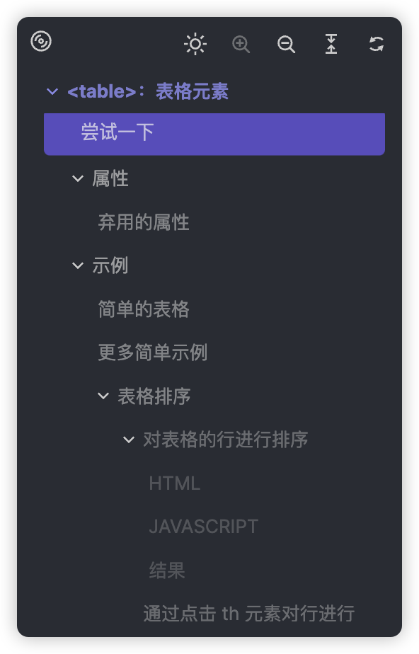

简体中文 · [English](./docs/README.zh-EN.md)

    

<h3 align="center">Quick Nav</h3>

一个浏览器插件。自动生成页面内容大纲（TOC），用户可点击大纲中的条目，快速定位到页面内的相应部分。

## 预览

    

## 功能

<table width="100%">
  <thead>
    <tr>
      <th width="50%" style="text-align: center">基本功能</th>
      <th width="50%"  style="text-align: center">可拖动</th>
    </tr>
  </thead>

  <tbody>
    <tr>
      <td></td>
      <td></td>
    </tr>
  </tbody>
</table>

<table width="100%">
  <thead>
    <tr>
      <th width="50%" style="text-align: center">窗口大小修改</th>
      <th width="50%" style="text-align: center">双击回到初始位置</th>
    </tr>
  </thead>

  <tbody>
    <tr>
      <td></td>
      <td></td>
    </tr>
  </tbody>
</table>

<table width="100%">
  <thead>
    <tr>
      <th width="50%" style="text-align: center">快速最大化</th>
      <th width="50%" style="text-align: center">隐藏｜显示一级</th>
    </tr>
  </thead>

  <tbody>
    <tr>
      <td></td>
      <td></td>
    </tr>
  </tbody>
</table>

<table width="100%">
  <thead>
    <tr>
      <th width="50%" style="text-align: center">展开｜隐藏</th>
      <th width="50%" style="text-align: center">隐藏｜显示一级</th>
    </tr>
  </thead>

  <tbody>
    <tr>
      <td></td>
      <td></td>
    </tr>
  </tbody>
</table>

<table width="100%">
  <thead>
    <tr>
      <th width="50%" style="text-align: center">全部展开｜全部隐藏</th>
      <th width="50%" style="text-align: center">主题色</th>

    </tr>

  </thead>

  <tbody>
    <tr>
      <td></td>
      <td></td>
    </tr>
  </tbody>
</table>
