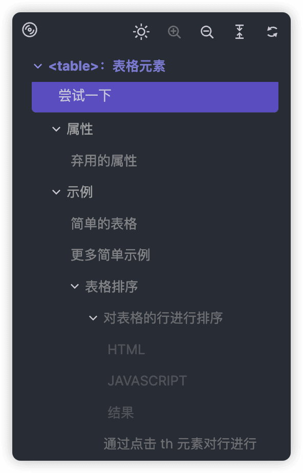
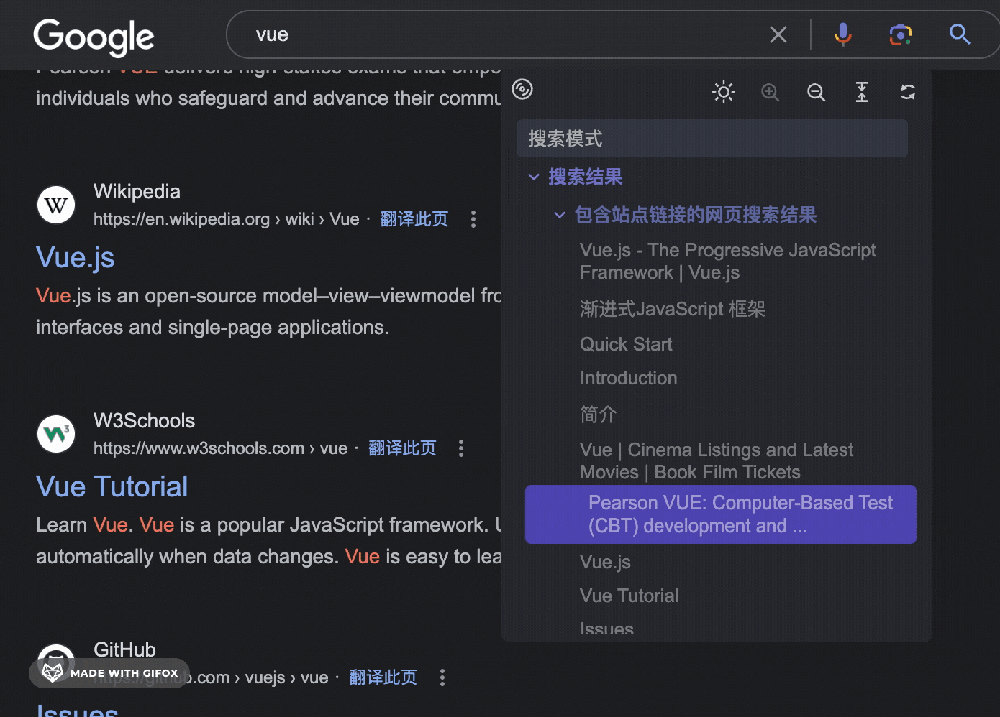
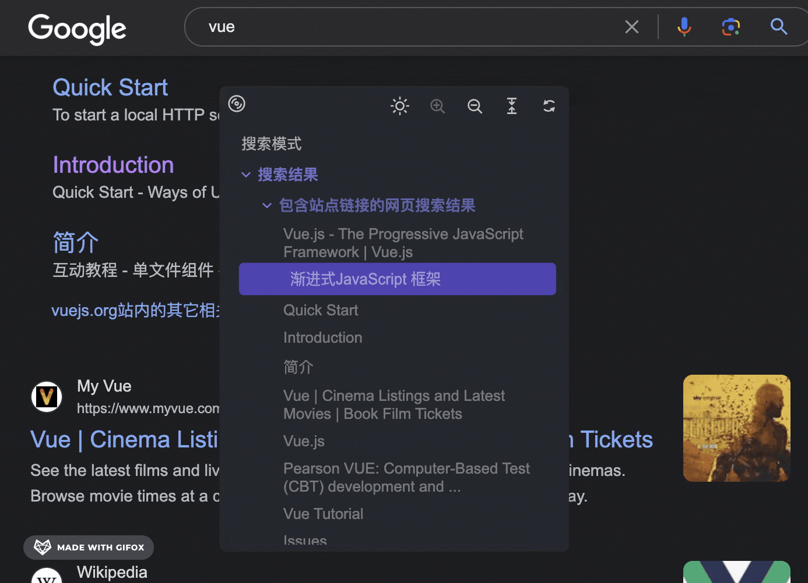
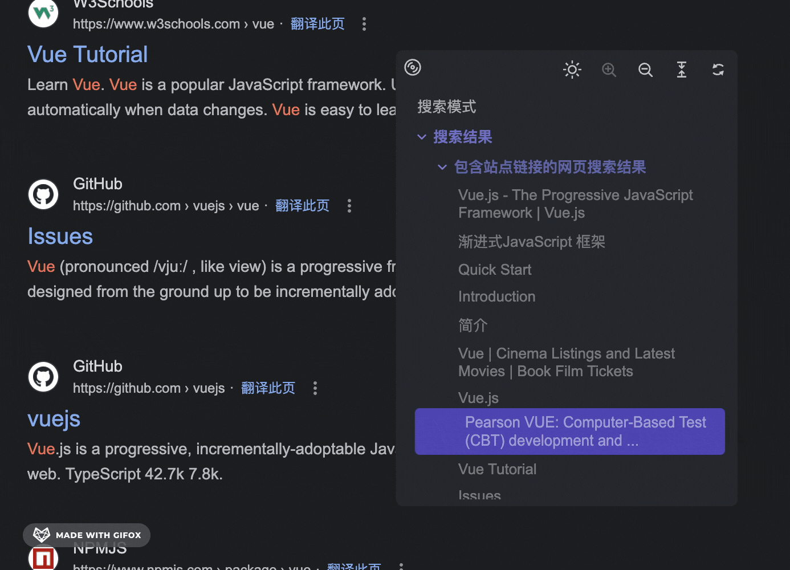
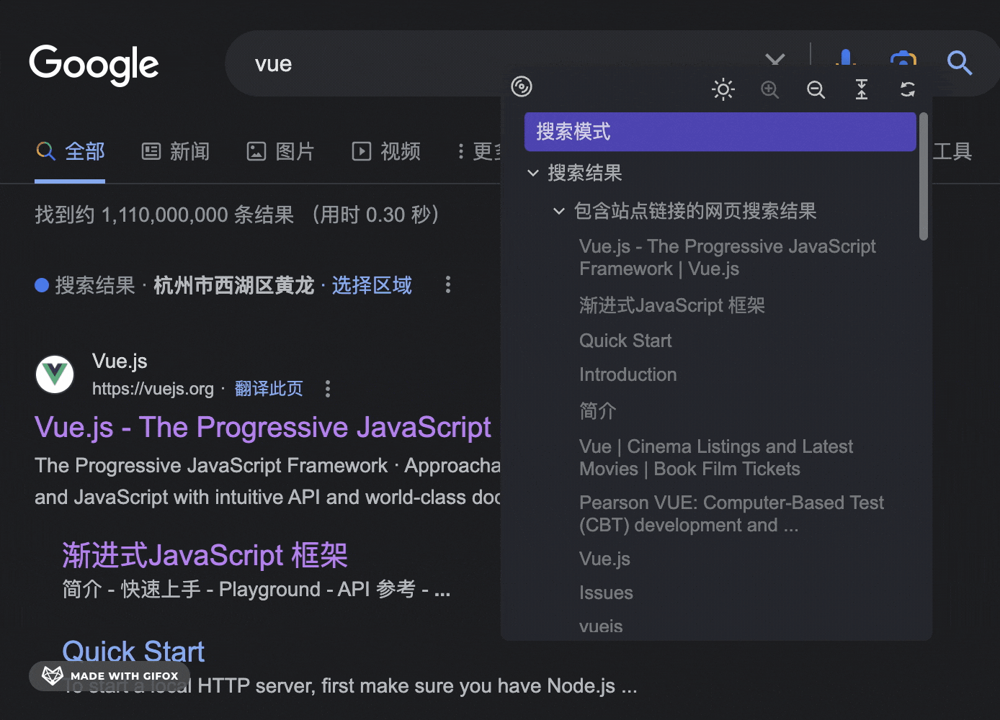
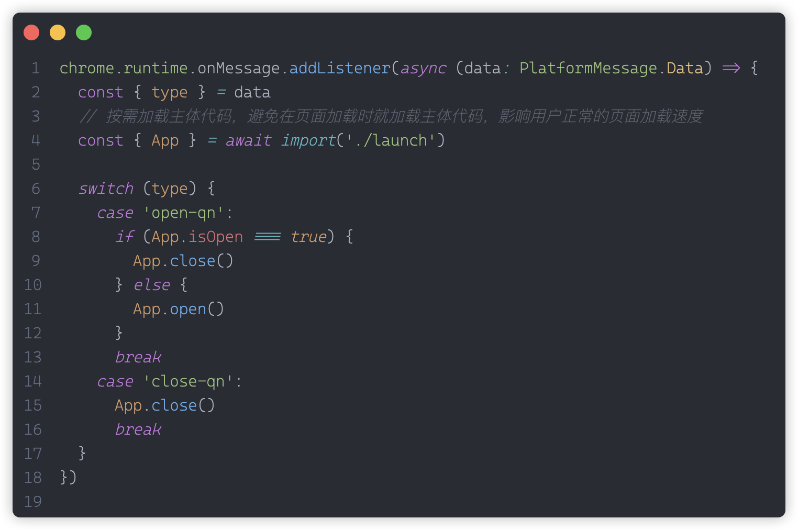
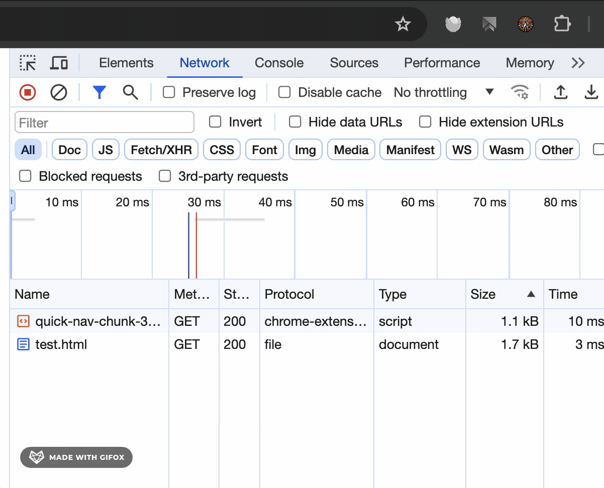

English · [简体中文](./docs/README.zh-EN.md) (by ChatGPT)

    

<h3 align="center">Quick Nav</h3>

A browser extension. Automatically generates a table of contents (TOC) for page content, allowing users to click on items in the outline to quickly navigate to the corresponding sections of the page.

## Preview

    

## Features

### Display

<table width="100%">
  <thead>
    <tr>
      <th width="50%" style="text-align: center">Basic Function</th>
      <th width="50%"  style="text-align: center">Draggable</th>
    </tr>
  </thead>

  <tbody>
    <tr>
      <td></td>
      <td></td>
    </tr>
  </tbody>
</table>

<table width="100%">
  <thead>
    <tr>
      <th width="50%" style="text-align: center">Window Size Modification</th>
      <th width="50%" style="text-align: center">Double-Click to Return to Original Position</th>
    </tr>
  </thead>

  <tbody>
    <tr>
      <td></td>
      <td></td>
    </tr>
  </tbody>
</table>

<table width="100%">
  <thead>
    <tr>
      <th width="50%" style="text-align: center">Expand | Hide</th>
      <th width="50%" style="text-align: center">Show | Hide Level 1</th>
    </tr>
  </thead>

  <tbody>
    <tr>
      <td></td>
      <td></td>
    </tr>
  </tbody>
</table>

<table width="100%">
  <thead>
    <tr>
      <th width="50%" style="text-align: center">Quick Maximize</th>
      <th width="50%" style="text-align: center">Refresh</th>
    </tr>
  </thead>

  <tbody>
    <tr>
      <td></td>
      <td></td>
    </tr>
  </tbody>
</table>

<table width="100%">
  <thead>
    <tr>
      <th width="50%" style="text-align: center">Expand All | Hide All</th>
      <th width="50%" style="text-align: center">Theme Color</th>
    </tr>
  </thead>

  <tbody>
    <tr>
      <td></td>
      <td></td>
    </tr>
  </tbody>

</table>

### Asynchronous Loading of Code

This extension injects a simple piece of code only when the page loads, not affecting the page's load speed. The main part of the code is requested only when the plugin icon is clicked (as shown below).

## Technology Stack

- [Vite](https://vitejs.dev)
- [Lit](https://lit.dev)

## To-Do

- [x] Close the plugin
- [ ] Search functionality
- [ ] Maximize / Minimize
- [ ] Return to the top
- [ ] Icon hints
- [ ] Navigate to the selected node
- [ ] Personalization settings
  - [ ] Background blur transparency
  - [ ] Custom colors
  - [ ] Enable / Disable icon hints
- [x] Draggable
- [x] Window size modification
- [x] Double-click to return to original position
- [x] Double-click border to maximize window
- [x] Refresh
- [x] Dark mode
- [x] Expand / Collapse
- [x] Expand / Collapse level 1

## Conclusion

Suggestions and ideas💡, CodeReview 💻 from all experts are welcome.
