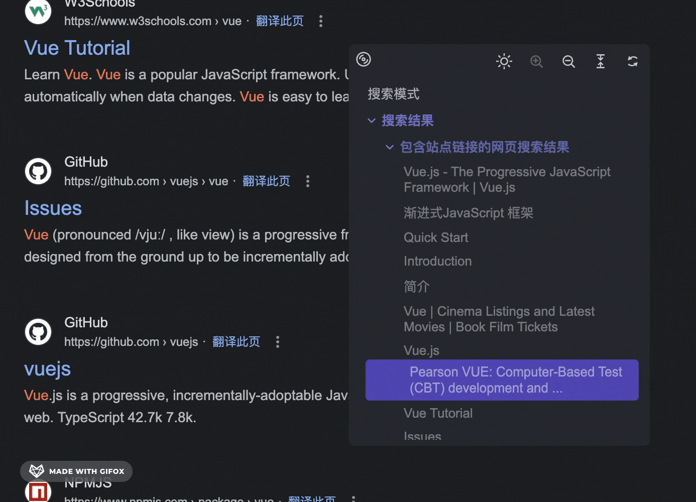
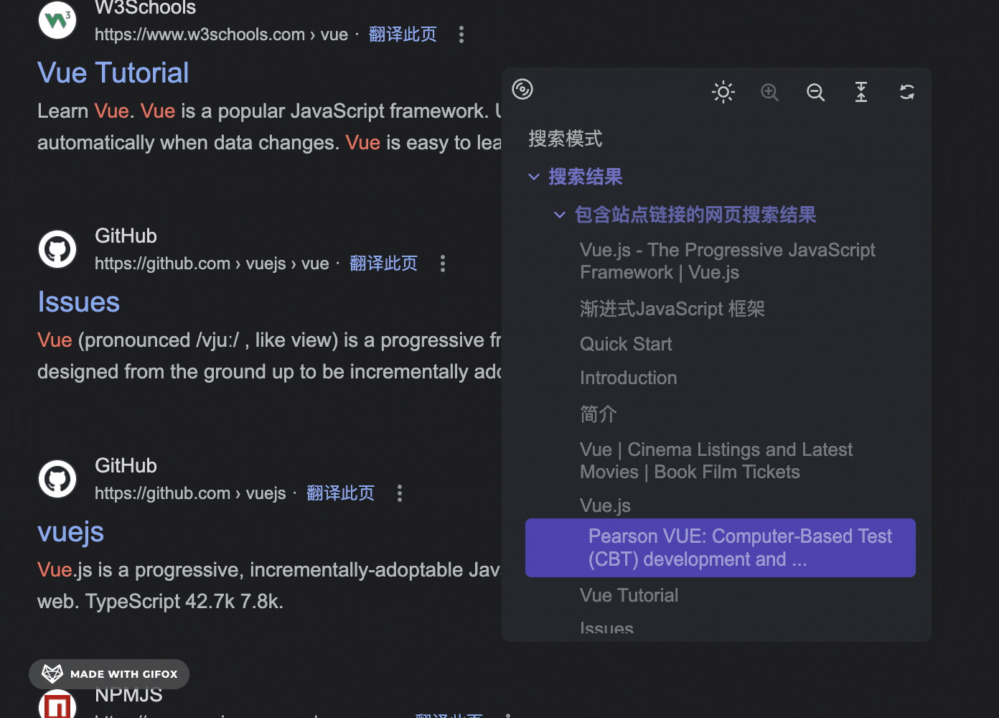

简体中文 · [English](../README.md) (by ChatGPT)

    

<h3 align="center">Quick Nav</h3>

一个浏览器插件。自动生成页面内容大纲（TOC），用户可点击大纲中的条目，快速定位到页面内的相应部分。

## 预览

    

## 功能

### 展示

<table width="100%">
  <thead>
    <tr>
      <th width="50%" style="text-align: center">基本功能</th>
      <th width="50%"  style="text-align: center">可拖动</th>
    </tr>
  </thead>

  <tbody>
    <tr>
      <td></td>
      <td></td>
    </tr>
  </tbody>
</table>

<table width="100%">
  <thead>
    <tr>
      <th width="50%" style="text-align: center">窗口大小修改</th>
      <th width="50%" style="text-align: center">双击回到初始位置</th>
    </tr>
  </thead>

  <tbody>
    <tr>
      <td></td>
      <td></td>
    </tr>
  </tbody>
</table>

<table width="100%">
  <thead>
    <tr>
      <th width="50%" style="text-align: center">展开｜隐藏</th>
      <th width="50%" style="text-align: center">显示 ｜ 隐藏一级</th>
    </tr>
  </thead>

  <tbody>
    <tr>
      <td></td>
      <td></td>
    </tr>
  </tbody>
</table>

<table width="100%">
  <thead>
    <tr>
      <th width="50%" style="text-align: center">快速最大化</th>
      <th width="50%" style="text-align: center">刷新</th>
    </tr>
  </thead>

  <tbody>
    <tr>
      <td></td>
      <td></td>
    </tr>
  </tbody>
</table>

<table width="100%">
  <thead>
    <tr>
      <th width="50%" style="text-align: center">全部展开｜隐藏</th>
      <th width="50%" style="text-align: center">主题色</th>
    </tr>
  </thead>

  <tbody>
    <tr>
      <td></td>
      <td></td>
    </tr>
  </tbody>
</table>

### 异步加载代码

这个插件只会在页面加载时注入一段简易的代码，不会影响页面的加载速度。点击插件图标时才会请求代码主体部分（如下图）。

## 技术栈

- [Vite](https://vitejs.dev)
- [Lit](https://lit.dev)

## 待办

- [x] 关闭插件
- [ ] 搜索功能
- [ ] 最大 / 小化
- [ ] 回到顶部
- [ ] 图标提示
- [ ] 定位到选中的节点
- [ ] 个性化设置
  - [ ] 背景毛玻璃透明
  - [ ] 自定义色彩
  - [ ] 开启 / 关闭图标提示
- [x] 可拖动
- [x] 窗口大小修改
- [x] 双击回到初始位置
- [x] 双击边框最大化窗口
- [x] 刷新
- [x] 暗色模式
- [x] 展开 / 关闭
- [x] 展开 / 关闭一级

## 结语

欢迎各位大佬提出建议，想法💡、CodeReview 💻 。
